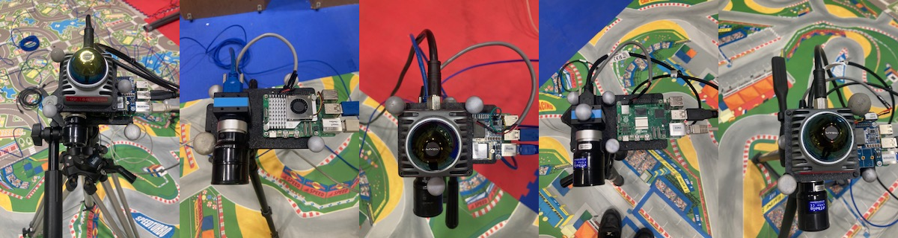
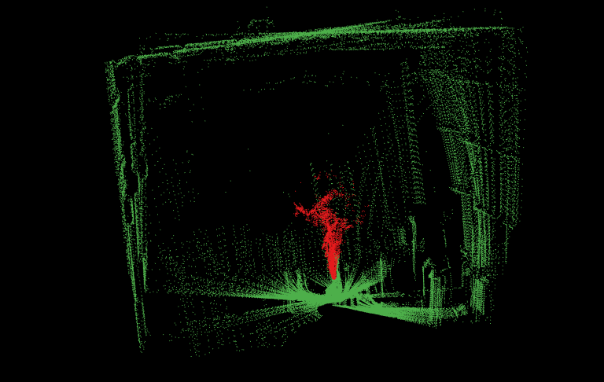
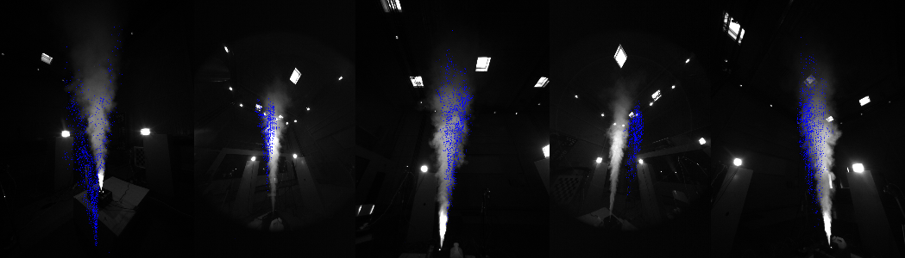

# LiCamFlow : Data set utils

LiCamFlow is a multi-view and multi-LiDAR dataset of smoke plume in different environments. The setup consists in 5 cameras + 3 LiDARs disposed around a fog machine used to generate the plume.

This repository gives some tools to use the dataset.

**Gaétan Pérez**, **Lou Denis**

**[LAAS](https://www.laas.fr/en/)**

## ╰┈➤ Introduction : the setup

This introduction part gives the context of the dataset, and some useful information to not get lost with the IDs used.

### Motion Capture

In order to get the position of the sensors, we use a Motion Capture system making it easier, and more robust to distrubances than a chessboard calibration.

#### Initialisation

To begin, each module which we want to know the position must be seen by the MoCap using markers. Four markers per modules are needed. They must be placed in different patterns so that the MoCap doesn't mix them. Make sure that all the markers can be seen by the cameras (i.e. don't put them below the module for instance).

The following image is an example on how to put the markers (please note that the positionning is not perfect since sometimes some markers are hardly seen by the cameras. This also is depending on the position of the modules inside the room.).



To properly register them in the MoCap software they must be positioned at the origin of the MoCap frame, facing all the same side so that the angles represent the same orientation for each one.

#### Ids

Each module gets an associated **id** number. Here is the list of ids corresponding to the names of the modules :

* **Edna :** 201
* **Vagrantini, LiDAR 108 :** 202
* **Raspy5-firefly :** 203
* **Reima, LiDAR 178:** 204
* **Edouilda, LiDAR 152 :** 205
* **Smoke :** 206

The **Smoke** corresponds to the fog machine, it is useful to express the positions in the frame of the fog machine. Meaning the smoke will be centered in (0, 0).

These IDs are the one used in the [utils programs](./utils/).

### Data Structure

Here is the structure of one sequence of the dataset

```bash
.
├── cam_201 # Raw .bmp images
├── cam_202 # Raw .bmp images
├── cam_203 # Raw .bmp images
├── cam_204 # Raw .bmp images
├── cam_205 # Raw .bmp images
├── camera_parameters.json # Camera parameters
├── lidars
│   ├── bag_2026-03-04_17-48_full_lidar # Raw merged pointclouds
│   ├── bag_2026-03-04_17-48_lidar # Raw bag file of separated pointclouds 
│   ├── full_pointclouds_txt
│   │   ├── full_cloud # .txt merged pcl using MoCap positions
│   │   ├── full_extracted # .pcd extracted smoke from full_cloud pcls
│   │   └── full_labelized # .pcd labellised smoke in full_cloud pcls
│   └── pointclouds
│       ├── lidar_192_168_2_108 # .txt pointclouds for each lidar
│       ├── lidar_192_168_2_152 # .txt pointclouds for each lidar
│       ├── lidar_192_168_2_178 # .txt pointclouds for each lidar
│       └── mocap_poses # .txt MoCap positions for each sensor
└── png_images
    ├── cam_201 # Re-oriented and converted to .png images
    ├── cam_202 # Re-oriented and converted to .png images
    ├── cam_203 # Re-oriented and converted to .png images
    ├── cam_204 # Re-oriented and converted to .png images
    └── cam_205 # Re-oriented and converted to .png images
```

### Data examples

* Labelised smoke plume in a merged pointcloud :


* 5 synchronised images of a smoke plume with pointclouds projected :


## ᕙ(•̀ ᗜ•́ )ᕗ. Get started

### Install the repository

```bash
# Clone repo
git clone https://github.com/Typos91/LiCamFlow.git
```

**Create python3 virtual environment :**

```bash
cd utils/python

python3 -m venv myenv # Create a virtual environment name 'myenv'

. myenv/bin/activate # Activate virtual environment

pip install -r requirements.txt # Install the requirments 
```

**Compile C++ packages :**

```bash
cd utils/cpp/package_to_compile # Move to the package to compile

mkdir build

cd build

cmake .. # Create the compilation folders
make # Compile packages

./package_to_compile # Launch program
```

## (╭ರ_•́). Overview of programs

### C++ packages

#### 1. lidar_merging

This program processes and merges LiDAR point cloud data from multiple sensors, aligning them to a common reference frame using motion capture (MoCap) data. The merged point clouds are saved as `.txt` files for further analysis. Each pointclouds has a label ***lidar_id*** enabling to know wich point clorresponds to which LiDAR.

Please see this [documentation file](./utils/cpp/lidar_merging/README.md)

#### 2. Smoke_labelling

This program aims to detect the presence of smoke in pointclouds. It creates a reference pointcloud with pointclouds without smoke, and then it compares the new scans with the reference. If a new element appears in the scan, which wasn't here during the creation of the reference cloud, it is then considered as smoke. It adds a label to each point 1 if smoke, 0 otherwise.

Please see this [documentation file](./utils/cpp/smoke_labelling/README.md)

### Python code

#### 1. bmp2png

Convert the `.bmp` images into `.png` images