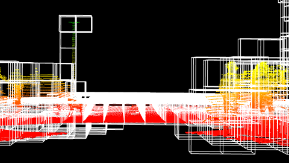
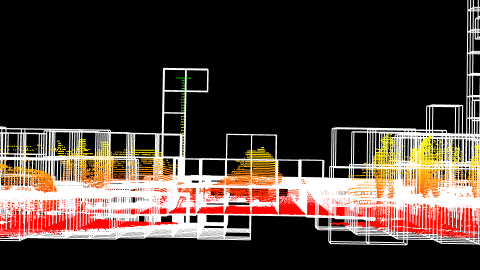
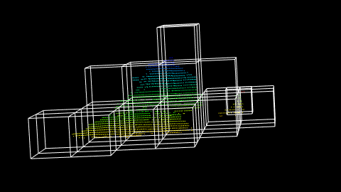
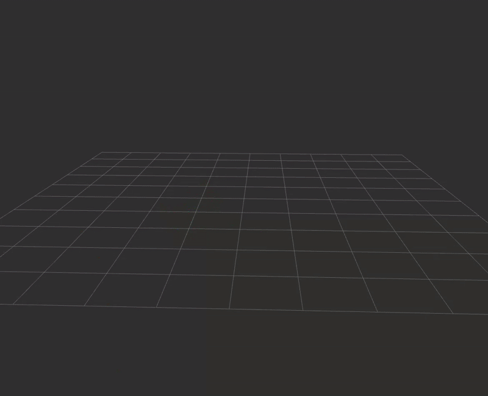

# Smoke labelling

This program aims to detect the presence of smoke in pointclouds. It creates a reference pointcloud with pointclouds without smoke, and then it compares the new scans with the reference. If a new element appears in the scan, which wasn't here during the creation of the reference cloud, it is then considered as smoke. It adds a label to each point 1 if smoke, 0 otherwise.

## Get started

### Building the program

In order to build this program:

```bash
cd smoke_labelling
mkdir build && cd build
cmake ..
make
```

### Launching

You can modify the parameters in the [config file](lidar/utils/cpp/smoke_labelling/config/arguments.json).

```bash
cd smoke_labelling/build/
./smoke_labelling
```

## Results

The program works with 3 steps:

- First step is to create a reference point cloud with the first data. These data must not contain smoke, since it will be used as a reference of the static world. Using the Octree object of PCL Library, a Voxel grid is created with voxels only where there is a point.



- Second step consists in creating a new voxel grid using the new pointclouds. In these data, smoke appears and new voxels are created.



- Now the final step is to compare both voxel grids that have been created, and extract the new ones. The new ones are the voxels that were added in step 2 and which don't correspond to any voxel of the first grid. As the smoke is the only element that was supposely added in the scene during the experiment, new voxels then correspond to smoke. We then label the points and re-add them in the original pointcloud.




